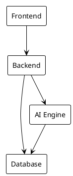
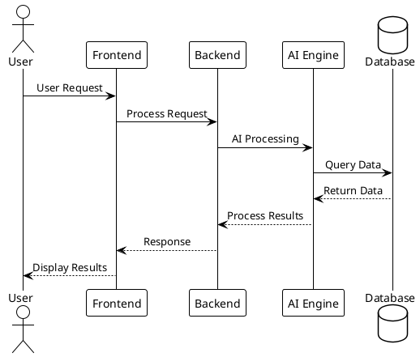
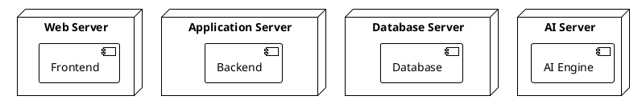
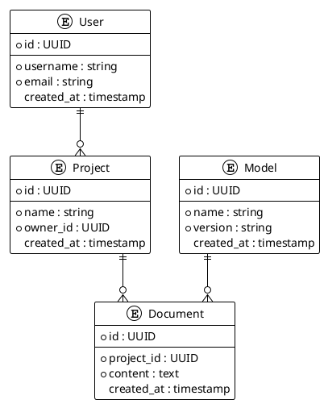
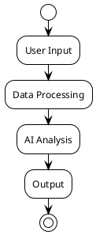
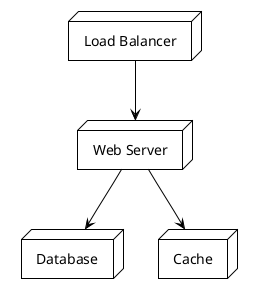
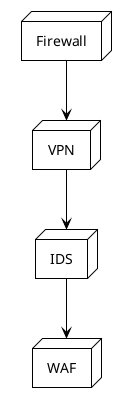
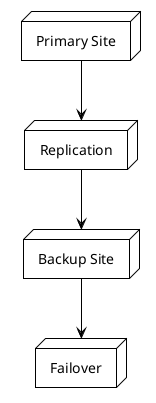

# Diagramstruktur Setup

## 1. Skapa diagramstruktur

Skapa följande mappstruktur:

```bash
mkdir -p diagrams/{system,data,infrastructure}
```

## 2. Skapa systemdiagram

### diagrams/system/component.puml


### diagrams/system/sequence.puml


### diagrams/system/deployment.puml


## 3. Skapa datadiagram

### diagrams/data/er.puml


### diagrams/data/data_model.puml
```plantuml
@startuml
!theme plain
skinparam classStyle rectangle

class User Model {
  +id: UUID
  +username: string
  +email: string
  +created_at: timestamp
}

class Project Model {
  +id: UUID
  +name: string
  +owner_id: UUID
  +created_at: timestamp
}

class Document Model {
  +id: UUID
  +project_id: UUID
  +content: text
  +created_at: timestamp
}

class AI Model {
  +id: UUID
  +name: string
  +version: string
  +created_at: timestamp
}

@enduml
```

### diagrams/data/data_flow.puml


## 4. Skapa infrastrukturdigram

### diagrams/infrastructure/network.puml


### diagrams/infrastructure/security.puml


### diagrams/infrastructure/dr.puml


## 5. Skapa hjälpverktyg

### diagrams/utils.py
```python
#!/usr/bin/env python3
"""
Diagram utilities for generating and validating diagrams.
"""

import subprocess
from pathlib import Path

def generate_diagram(puml_file: Path, output_format: str = "png") -> bool:
    """Generate diagram from PlantUML file."""
    try:
        subprocess.run(
            ["plantuml", f"-t{output_format}", str(puml_file)],
            check=True
        )
        return True
    except subprocess.CalledProcessError:
        return False

def validate_diagram(puml_file: Path) -> bool:
    """Validate PlantUML file syntax."""
    try:
        subprocess.run(
            ["plantuml", "-checkonly", str(puml_file)],
            check=True
        )
        return True
    except subprocess.CalledProcessError:
        return False

def export_diagram(puml_file: Path, output_format: str = "png") -> bool:
    """Export diagram to specified format."""
    return generate_diagram(puml_file, output_format)
```

### diagrams/config.py
```python
#!/usr/bin/env python3
"""
Configuration for diagram generation.
"""

from pathlib import Path

# Diagram directories
DIAGRAM_DIRS = {
    "system": Path("diagrams/system"),
    "data": Path("diagrams/data"),
    "infrastructure": Path("diagrams/infrastructure")
}

# Required diagram files
REQUIRED_DIAGRAMS = {
    "system": ["component.puml", "sequence.puml", "deployment.puml"],
    "data": ["er.puml", "data_model.puml", "data_flow.puml"],
    "infrastructure": ["network.puml", "security.puml", "dr.puml"]
}

# Output formats
OUTPUT_FORMATS = ["png", "svg", "pdf"]
```

## 6. Installera PlantUML

```bash
# För Ubuntu/Debian
sudo apt-get install plantuml

# För macOS
brew install plantuml

# För Windows (med Chocolatey)
choco install plantuml
```

## 7. Verifiera installation

```bash
# Verifiera PlantUML installation
plantuml -version

# Generera alla diagram
python -c "
from pathlib import Path
from diagrams.utils import generate_diagram

for puml_file in Path('diagrams').rglob('*.puml'):
    generate_diagram(puml_file)
"
```

## 8. Nästa steg

Efter att ha kört dessa kommandon, kör:

```bash
# Rensa testcache
pytest --cache-clear

# Kör testerna igen
pytest tests/unit/architecture/test_architecture_diagrams.py -v
```

Detta bör lösa System Overview-testet och låta oss fortsätta med nästa steg i utvecklingen. 