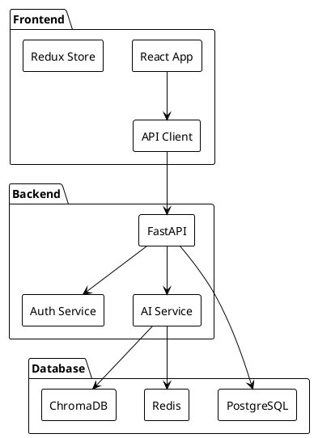
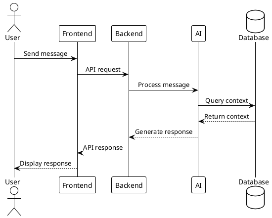
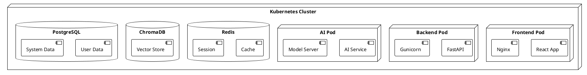
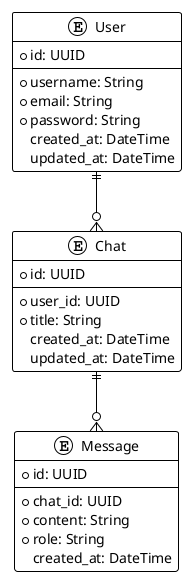
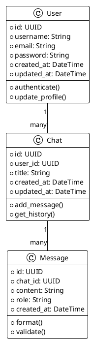
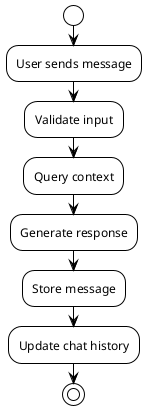
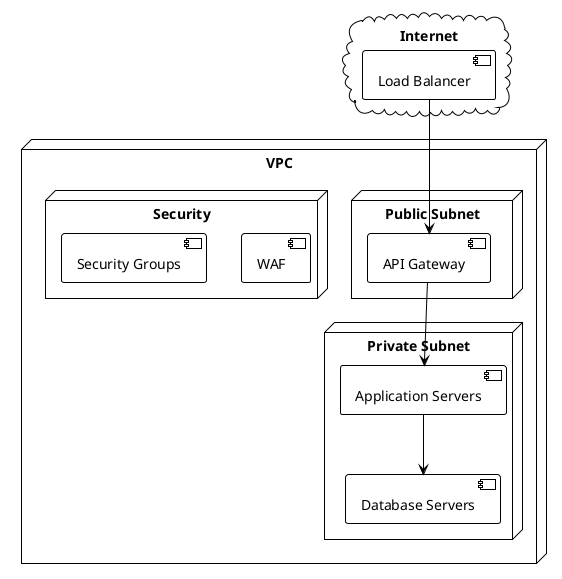
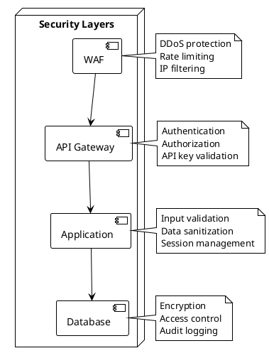
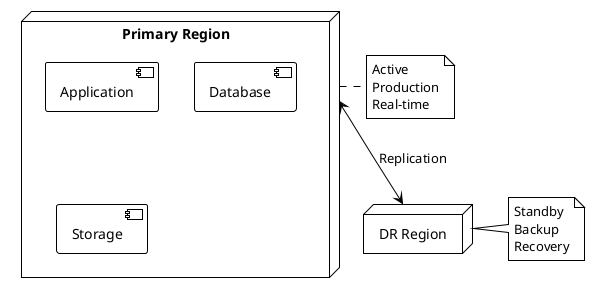

# Arkitekturdiagram

Detta dokument beskriver hur man skapar och underhåller arkitekturdiagram för Geometra AI-systemet.

## Översikt

Arkitekturdiagrammen innehåller:

1. **Systemdiagram**
   - Komponentdiagram
   - Sekvensdiagram
   - Deploymentdiagram

2. **Datadiagram**
   - ER-diagram
   - Datamodeller
   - Dataflöden

3. **Infrastrukturdigram**
   - Nätverksdiagram
   - Säkerhetsdiagram
   - DR-diagram

## Installation

1. Installera diagramverktyg:
```bash
pip install graphviz plantuml pydot
```

2. Skapa diagramstruktur:
```bash
mkdir -p diagrams/{system,data,infrastructure}
```

## Konfiguration

### Systemdiagram

1. Skapa `diagrams/system/components.puml`:


2. Skapa `diagrams/system/sequence.puml`:


3. Skapa `diagrams/system/deployment.puml`:


### Datadiagram

1. Skapa `diagrams/data/er.puml`:


2. Skapa `diagrams/data/models.puml`:


3. Skapa `diagrams/data/flows.puml`:


### Infrastrukturdigram

1. Skapa `diagrams/infrastructure/network.puml`:


2. Skapa `diagrams/infrastructure/security.puml`:


3. Skapa `diagrams/infrastructure/dr.puml`:


## Validering

1. Generera diagram:
```bash
plantuml diagrams/**/*.puml
```

2. Verifiera diagram:
```bash
python -m diagrams.validate
```

3. Uppdatera dokumentation:
```bash
python -m diagrams.update_docs
```

## Felsökning

### Diagramproblem

1. **Genereringsproblem**
   - Kontrollera PlantUML-syntax
   - Verifiera filformat
   - Validera struktur

2. **Valideringsproblem**
   - Kontrollera länkar
   - Verifiera noder
   - Validera relationer

3. **Dokumentationsproblem**
   - Kontrollera referenser
   - Verifiera beskrivningar
   - Validera format

## Loggning

1. Konfigurera loggning i `diagrams/utils/logging.py`:
```python
"""Diagram logging configuration."""

import logging
import os
from datetime import datetime

def setup_diagram_logging():
    """Configure logging for diagrams."""
    log_dir = "logs/diagrams"
    os.makedirs(log_dir, exist_ok=True)
    
    log_file = os.path.join(
        log_dir,
        f"diagrams_{datetime.now().strftime('%Y%m%d')}.log"
    )
    
    logging.basicConfig(
        level=logging.INFO,
        format='%(asctime)s - %(name)s - %(levelname)s - %(message)s',
        handlers=[
            logging.FileHandler(log_file),
            logging.StreamHandler()
        ]
    )
```

## Nästa steg

1. Implementera [Monitoring](32_MONITORING.md)
2. Konfigurera [Säkerhet](33_SÄKERHET.md)
3. Skapa [Dokumentation](34_DOKUMENTATION.md) 